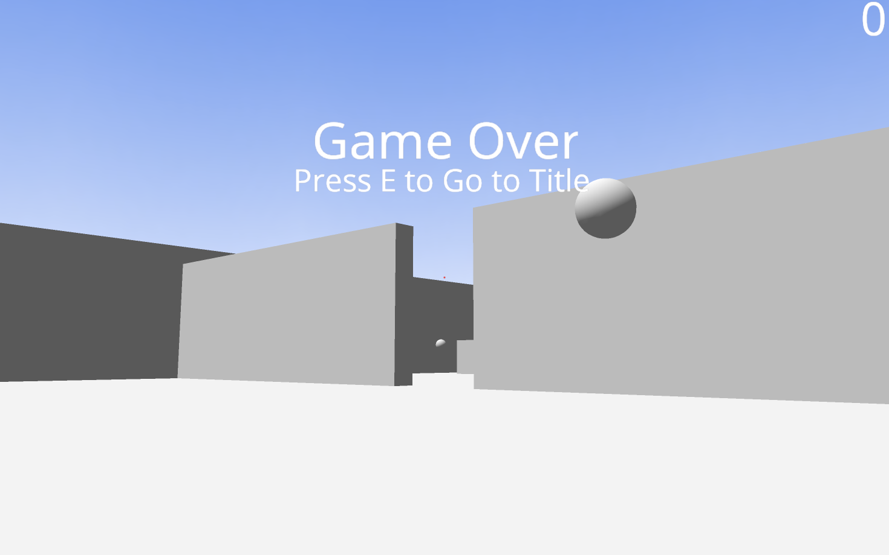

# wgpu Simple FPS

## What is this?

This is a simple FPS game created to learn [wgpu](https://github.com/gfx-rs/wgpu).
As such, it isn't polished as a game.

## What I learned

About wgpu:

- Surface clearing
- Polygon drawing
- Instancing
- Multiple render pipelines
- Depth testing
- Image texture sampling
- Alpha blending

About other aspects:

- Creating cuboids, rectangles, spheres
- First-person movement
- Wall collisions
- Target shooting

## Build

On Windows, macOS or Linux:

1. install Rust
2. compile and run `model/create.rs`
3. `cargo build`
